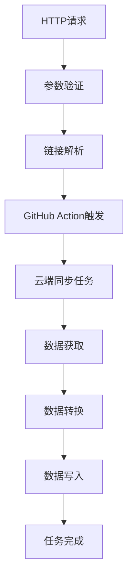

# 微信读书同步飞书多维表格 - 产品需求文档

## 1. 产品概述

本项目旨在将现有的微信读书同步到Notion的功能改造为微信读书同步到飞书多维表格的解决方案。通过飞书Base Open SDK，实现微信读书的书籍信息、划线、想法等数据自动同步到飞书多维表格中，为用户提供更便捷的读书笔记管理体验。

项目将保持原有微信读书数据获取逻辑不变，仅替换数据写入部分的实现，从Notion API切换到飞书多维表格API。

## 2. 核心功能

### 2.1 用户角色

| 角色 | 注册方法 | 核心权限 |
|------|----------|----------|
| 普通用户 | 提供飞书多维表格链接和授权码 | 可同步微信读书数据到指定的飞书多维表格 |

### 2.2 功能模块

本项目包含以下核心功能模块：

1. **HTTP API接口**：接收同步参数并触发GitHub Action执行同步任务
2. **GitHub Action工作流**：在云端执行微信读书数据同步到飞书多维表格
3. **任务状态管理**：跟踪和查询同步任务的执行状态

### 2.3 功能模块详情

| 模块名称 | 功能组件 | 功能描述 |
|----------|----------|----------|
| HTTP API服务 | 同步接口 | 接收POST请求，包含多维表格链接、授权码、微信读书Cookie等参数 |
| HTTP API服务 | 链接解析器 | 从飞书多维表格链接中提取appToken和tableId |
| HTTP API服务 | 参数验证器 | 验证请求参数的完整性和有效性 |
| GitHub Action触发器 | 任务调度器 | 通过GitHub API触发repository_dispatch事件 |
| GitHub Action触发器 | 状态管理器 | 记录和跟踪同步任务的执行状态 |
| 同步执行引擎 | 数据获取模块 | 从微信读书API获取书籍、划线、想法数据 |
| 同步执行引擎 | 数据转换模块 | 将微信读书数据格式转换为飞书多维表格格式 |
| 同步执行引擎 | 数据写入模块 | 使用Base Open SDK将数据写入飞书多维表格 |

## 3. 核心流程

### 用户操作流程

1. 用户在飞书多维表格中创建用于存储读书数据的表格
2. 用户获取表格的PersonalBaseToken授权码和多维表格链接
3. 用户获取微信读书的Cookie信息
4. 用户通过HTTP POST请求发送同步参数到API接口
5. 系统自动解析链接，提取appToken和tableId
6. 系统验证参数有效性并触发GitHub Action
7. GitHub Action在云端执行数据同步任务
8. 用户可通过状态查询接口跟踪同步进度和结果

## 4. 接口设计规范

### 4.1 API响应格式

- 统一使用JSON格式返回数据
- 状态码遵循HTTP标准（200成功，400客户端错误，500服务器错误）
- 响应体包含code、message、data三个基础字段
- 错误信息提供详细的错误描述和错误码
- 时间格式统一使用ISO 8601标准

### 4.2 请求参数验证

| 参数类型 | 验证规则 | 错误处理 |
|----------|----------|----------|
| 多维表格链接 | URL格式验证、飞书域名检查、包含必要参数 | 返回具体的格式错误信息 |
| 授权码 | 非空验证、格式检查、权限验证 | 返回授权失败的具体原因 |
| 微信读书Cookie | 格式验证、有效性检查 | 返回Cookie无效或过期提示 |
| 同步参数 | 枚举值验证、参数组合检查 | 返回参数错误的详细说明 |

### 4.3 日志和监控

- 记录所有API请求和响应的关键信息
- 对敏感信息（如Cookie、授权码）进行脱敏处理
- 提供详细的错误堆栈信息用于问题排查
- 支持按任务ID跟踪完整的同步流程