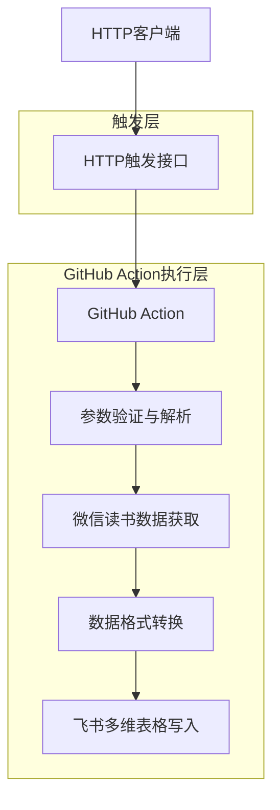
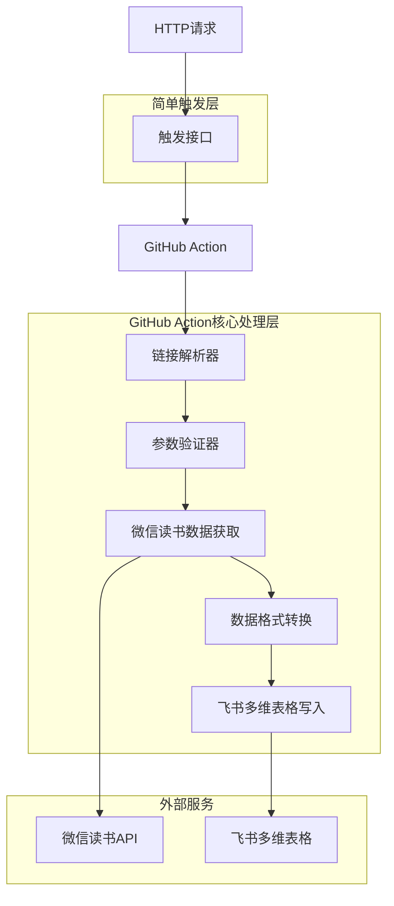
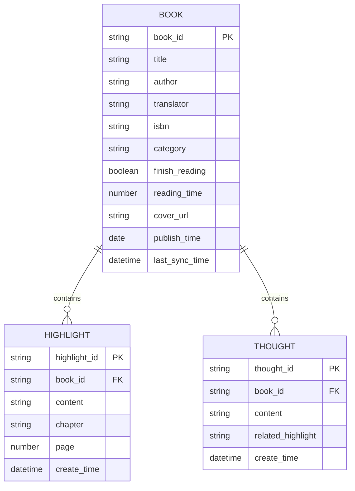

# 微信读书同步飞书多维表格 - 技术架构文档

## 1. 架构设计



## 2. 技术描述

- Frontend: 无
- HTTP触发器: 简单的HTTP接口（可用云函数或GitHub Webhook）
- 核心处理: GitHub Actions + Node.js + TypeScript + @lark-base-open/node-sdk
- 数据源: 微信读书 Web API
- 数据存储: 飞书多维表格

## 3. API路由定义

| 路由 | 方法 | 目的 |
|------|------|------|
| /webhook/sync | POST | 接收同步参数并直接触发GitHub Action |
| /health | GET | 健康检查接口 |

## 4. API定义

### 4.1 HTTP触发接口

**同步任务触发接口**
```
POST /webhook/sync
```

请求体:
| 参数名 | 参数类型 | 是否必需 | 描述 |
|--------|----------|----------|------|
| bitable_url | string | true | 飞书多维表格链接 |
| personal_base_token | string | true | 多维表格授权码 |
| weread_cookie | string | true | 微信读书Cookie |
| sync_mode | string | false | 同步模式：full/incremental，默认incremental |
| book_ids | string[] | false | 指定同步的书籍ID列表，为空则同步所有 |

响应:
```json
{
  "success": true,
  "message": "同步任务已触发",
  "run_id": "github_action_run_id"
}
```

示例请求:
```json
{
  "bitable_url": "https://example.feishu.cn/base/bascnxxxxxx?table=tblxxxxxx",
  "personal_base_token": "patxxxxxxxxxxxxxx",
  "weread_cookie": "wr_vid=xxxxx;wr_skey=xxxxx",
  "sync_mode": "incremental"
}
```

### 4.2 飞书多维表格API

**创建书籍记录**
```typescript
client.base.appTableRecord.create({
  path: { table_id: 'tblxxxxxx' },
  data: {
    fields: {
      '书名': '示例书名',
      '作者': '示例作者',
      '阅读状态': '已读完'
    }
  }
})
```

**批量更新记录**
```typescript
client.base.appTableRecord.batchUpdate({
  path: { table_id: 'tblxxxxxx' },
  data: {
    records: [{
      record_id: 'recxxxxxx',
      fields: {
        '划线内容': '更新的划线内容',
        '想法': '更新的想法内容'
      }
    }]
  }
})
```

### 4.3 数据结构映射

**微信读书数据 → 飞书多维表格字段映射**

| 微信读书字段 | 飞书表格字段 | 字段类型 | 说明 |
|-------------|-------------|----------|------|
| title | 书名 | 单行文本 | 书籍标题 |
| author | 作者 | 单行文本 | 作者姓名 |
| translator | 译者 | 单行文本 | 译者姓名（如有） |
| isbn | ISBN | 单行文本 | 书籍ISBN号 |
| category | 分类 | 单选 | 书籍分类 |
| finishReading | 阅读状态 | 单选 | 已读完/未读完 |
| readingTime | 阅读时长 | 数字 | 阅读时长（分钟） |
| noteCount | 笔记数量 | 数字 | 划线和想法总数 |
| highlights | 划线内容 | 多行文本 | 所有划线内容 |
| thoughts | 想法内容 | 多行文本 | 所有想法内容 |
| cover | 封面 | 附件 | 书籍封面图片 |
| publishTime | 出版时间 | 日期 | 书籍出版日期 |
| lastSyncTime | 最后同步时间 | 日期时间 | 数据最后同步时间 |

## 5. 服务架构图



## 6. 数据模型

### 6.1 数据模型定义



### 6.2 飞书多维表格DDL

**主表结构（书籍信息表）**
```sql
-- 飞书多维表格字段配置
书名: 单行文本（主字段）
作者: 单行文本
译者: 单行文本
ISBN: 单行文本
分类: 单选（文学、科技、历史、其他）
阅读状态: 单选（已读完、未读完）
阅读时长: 数字（分钟）
笔记数量: 数字
划线内容: 多行文本
想法内容: 多行文本
封面: 附件
出版时间: 日期
最后同步时间: 日期时间
```

**配置表结构（同步配置表）**
```sql
-- 同步配置表字段
配置名称: 单行文本（主字段）
同步模式: 单选（全量、增量）
启用状态: 复选框
过滤作者: 多行文本
过滤分类: 多选
按章节组织: 复选框
创建时间: 日期时间
更新时间: 日期时间
```

## 7. 核心实现步骤

### 7.1 HTTP触发器搭建
1. 创建简单的触发接口：
```typescript
// 可以使用Vercel函数、Netlify函数或简单的Express服务
export default async function handler(req, res) {
  if (req.method !== 'POST') {
    return res.status(405).json({ error: 'Method not allowed' });
  }

  const { bitable_url, personal_base_token, weread_cookie, sync_mode, book_ids } = req.body;
  
  // 直接触发GitHub Action
  const result = await triggerGitHubAction({
    bitable_url,
    personal_base_token,
    weread_cookie,
    sync_mode: sync_mode || 'incremental',
    book_ids
  });

  res.json({ success: true, message: '同步任务已触发', run_id: result.run_id });
}
```

### 7.2 GitHub Action工作流配置

创建 `.github/workflows/sync-weread.yml`：
```yaml
name: 微信读书同步到飞书多维表格

on:
  repository_dispatch:
    types: [sync-weread]

jobs:
  sync:
    runs-on: ubuntu-latest
    steps:
      - uses: actions/checkout@v3
      
      - name: Setup Node.js
        uses: actions/setup-node@v3
        with:
          node-version: '18'
          
      - name: Install dependencies
        run: npm ci
        
      - name: 解析和验证参数
        id: validate
        env:
          BITABLE_URL: ${{ github.event.client_payload.bitable_url }}
          PERSONAL_BASE_TOKEN: ${{ github.event.client_payload.personal_base_token }}
          WEREAD_COOKIE: ${{ github.event.client_payload.weread_cookie }}
          SYNC_MODE: ${{ github.event.client_payload.sync_mode }}
        run: |
          node -e "
          const url = process.env.BITABLE_URL;
          const urlObj = new URL(url);
          const pathParts = urlObj.pathname.split('/');
          const appToken = pathParts[pathParts.indexOf('base') + 1];
          const tableId = urlObj.searchParams.get('table');
          console.log('APP_TOKEN=' + appToken);
          console.log('TABLE_ID=' + tableId);
          " >> $GITHUB_OUTPUT
        
      - name: 执行同步任务
        env:
          APP_TOKEN: ${{ steps.validate.outputs.APP_TOKEN }}
          TABLE_ID: ${{ steps.validate.outputs.TABLE_ID }}
          PERSONAL_BASE_TOKEN: ${{ github.event.client_payload.personal_base_token }}
          WEREAD_COOKIE: ${{ github.event.client_payload.weread_cookie }}
          SYNC_MODE: ${{ github.event.client_payload.sync_mode }}
        run: npm run sync
```

### 7.3 同步任务触发逻辑

```typescript
import { Octokit } from '@octokit/rest';

export async function triggerGitHubAction(params: SyncParams) {
  const octokit = new Octokit({
    auth: process.env.GITHUB_TOKEN
  });

  const result = await octokit.repos.createDispatchEvent({
    owner: process.env.GITHUB_OWNER!,
    repo: process.env.GITHUB_REPO!,
    event_type: 'sync-weread',
    client_payload: {
      bitable_url: params.bitable_url,
      personal_base_token: params.personal_base_token,
      weread_cookie: params.weread_cookie,
      sync_mode: params.sync_mode || 'incremental',
      book_ids: params.book_ids
    }
  });

  return { run_id: result.data?.id };
}
```

### 7.4 GitHub Action中的核心处理逻辑

在GitHub Action中创建处理脚本 `scripts/sync-handler.js`：
```javascript
const { BaseClient } = require('@lark-base-open/node-sdk');

// 1. 解析飞书多维表格链接
function parseBitableUrl(url) {
  const urlObj = new URL(url);
  const pathParts = urlObj.pathname.split('/');
  const appToken = pathParts[pathParts.indexOf('base') + 1];
  const tableId = urlObj.searchParams.get('table');
  
  if (!appToken || !tableId) {
    throw new Error('无效的多维表格链接');
  }
  
  return { appToken, tableId };
}

// 2. 验证参数
function validateParams(params) {
  const { bitable_url, personal_base_token, weread_cookie } = params;
  
  if (!bitable_url || !personal_base_token || !weread_cookie) {
    throw new Error('缺少必要参数');
  }
  
  // 验证Cookie格式
  if (!weread_cookie.includes('wr_vid') || !weread_cookie.includes('wr_skey')) {
    throw new Error('微信读书Cookie格式不正确');
  }
}

// 3. 执行同步
async function executeSync() {
  try {
    // 获取环境变量
    const params = {
      bitable_url: process.env.BITABLE_URL,
      personal_base_token: process.env.PERSONAL_BASE_TOKEN,
      weread_cookie: process.env.WEREAD_COOKIE,
      sync_mode: process.env.SYNC_MODE || 'incremental'
    };
    
    // 验证参数
    validateParams(params);
    
    // 解析链接
    const { appToken, tableId } = parseBitableUrl(params.bitable_url);
    
    // 创建飞书客户端
    const client = new BaseClient({
      appToken,
      personalBaseToken: params.personal_base_token
    });
    
    // 执行同步逻辑（调用原有的同步代码）
    await syncWereadToFeishu(client, tableId, params.weread_cookie, params.sync_mode);
    
    console.log('同步完成');
  } catch (error) {
    console.error('同步失败:', error.message);
    process.exit(1);
  }
}

executeSync();
```

### 7.5 环境变量配置

```bash
# GitHub配置
GITHUB_TOKEN=ghp_xxxxxxxxxxxxxx
GITHUB_OWNER=your-username
GITHUB_REPO=weread-to-bitable

# 服务配置
PORT=3000
NODE_ENV=production
```

### 7.6 部署配置

**Vercel部署（vercel.json）**
```json
{
  "version": 2,
  "builds": [
    {
      "src": "src/server.ts",
      "use": "@vercel/node"
    }
  ],
  "routes": [
    {
      "src": "/api/(.*)",
      "dest": "src/server.ts"
    }
  ]
}
```

**Docker部署（Dockerfile）**
```dockerfile
FROM node:18-alpine
WORKDIR /app
COPY package*.json ./
RUN npm ci --only=production
COPY . .
RUN npm run build
EXPOSE 3000
CMD ["npm", "start"]
```